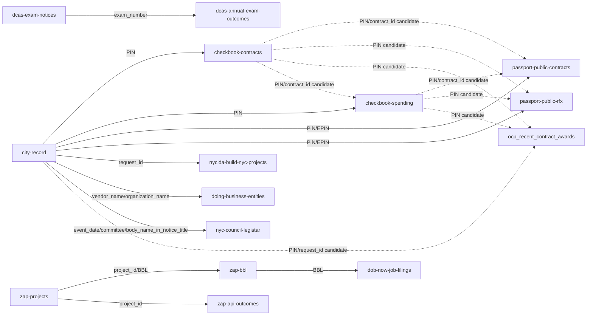

<!-- Generated by tools/depot_rederive.mjs from site/data/gap_taxonomy.json. Do not edit by hand. -->

# Lifecycle gap taxonomy

When a lifecycle slot is empty, the reader must see **which kind of gap** it is.

| Class | Register | Meaning |
|---|---|---|
| **not_yet_ingested** (a) | “Not yet shown here — … live in *source*.” | A public source publishes this field. Empty means incomplete join or missing adapter. |
| **not_published** (b) | “The city does not publish this — it would appear in *where* if released.” | No public, joinable release is known. Name the logical home when one exists. |

Operational messages (source unreachable, ambiguous multi-match) stay outside this taxonomy.

The executable inventory is [`site/data/gap_taxonomy.json`](../site/data/gap_taxonomy.json).
The **depot** is the join graph in that file (`sources` + `crosswalks`), not the gap list alone.
Refresh with `node tools/depot_rederive.mjs` after any source-contract or taxonomy change.

## Inventory summary

| Gap | Class | Disposition | Public home or “would appear in” | Closure receipt |
|---|---|---|---|---|
| notice detail · attachment metadata | a | landed | City Record Online file attachments | [receipt](https://github.com/cityscroll/crol-list/pull/411) |
| contract lifecycle · pending stage | a | landed | Checkbook NYC Contracts | [receipt](https://github.com/cityscroll/crol-list/pull/141) |
| contract lifecycle · registered stage | a | landed | Checkbook NYC Contracts | [receipt](https://github.com/cityscroll/crol-list/pull/141) |
| contract lifecycle · payment stage | a | landed | Checkbook NYC Spending | [receipt](https://github.com/cityscroll/crol-list/pull/141) |
| contract lifecycle · provenance when PIN missing | b | publication_blocked | Checkbook NYC registrations and payments (joined by PIN) if the notice published a Procurement ID | — |
| contract lifecycle · tender / package documents **CLASS CHANGE** | b | measured_stop | City Record Online file attachments (GetFile on a856-cityrecord.nyc.gov) if the notice published package documents | — |
| OCDS tender/numberOfTenderers · contestability package | a | measured_stop | Bid Tabulations (Historical) | — |
| award detail enrichment beyond City Record | a | landed | Recent Contract Awards (OCP) | [receipt](https://github.com/cityscroll/crol-list/pull/176) |
| OCDS planning/budget and planning/rationale | b | measured_stop | the Capital Projects open dataset (n7gv-k5yt) if released with a PIN/EPIN that joins to the notice — https://data.cityofnewyork.us/d/n7gv-k5yt — or agency budget justifications / MOCS procurement plans if released as stable machine data | — |
| award notice · prime-win sub-outreach (data wishlist only) | b | publication_blocked | agency or Comptroller subcontract-utilization / M/WBE goal reports if released as a joinable public feed keyed by PIN or contract id — https://comptroller.nyc.gov/reports/nyc-contracts/ | — |
| subsidy lifecycle · per-stage empty slot | a | open | NYCIDA/Build NYC public documents | — |
| subsidy lifecycle · stage outcome | b | publication_blocked | Build NYC / NYCIDA project documents (board minutes, closing packages) if an explicit outcome field is released | — |
| subsidy lifecycle · no project join | b | open | NYCIDA/Build NYC financial public documents page if a project record is released for the notice | — |
| subsidy lifecycle · company / place / money fields | b | publication_blocked | the linked Build NYC project record if those fields are filled on publication | — |
| subsidy lifecycle · company / place / money when only City Record hearing is joined | a | open | NYCIDA/Build NYC public documents | — |
| Council meeting outcomes · no event join | a | landed | NYC Council Legistar API | [receipt](https://github.com/cityscroll/crol-list/pull/191) |
| Council meeting outcomes · matter without roll-call detail | a | timing | NYC Council Legistar votes | — |
| Council meeting outcomes · event without agenda matters | a | timing | NYC Council Legistar agenda items | — |
| non-Council hearings · votes | b | publication_blocked | borough president websites and community board minutes / vote pages if released as a citywide machine-readable open data feed (not only member rosters) | — |
| Agency Rules notice detail · lifecycle event slots without an NYC Rules join | a | landed | NYC Rules RSS feed | [receipt](https://github.com/cityscroll/crol-list/pull/252) |
| Agency Rules notice detail · missing hearing, comment, adoption, or effective date on a joined rule | b | publication_blocked | the official NYC Rules rule page and RSS fields if the agency releases that lifecycle date | — |
| staffing exam cards · post-cycle outcomes | a | landed | DCAS annual civil-service exam outcome aggregates + Civil Service List (Active) exam-level counts | [receipt](https://github.com/cityscroll/crol-list/pull/175) |
| per-applicant exam results | b | publication_blocked | DCAS candidate portals only if individual results were released as public open data (they are not) | — |
| staffing exam card · fee or salary null **CLASS CHANGE** | a | landed | DCAS open-competitive exam schedule and Notices of Examination | [receipt](https://github.com/cityscroll/crol-list/pull/366) |
| agency awards empty state · verified absent | b | publication_blocked | NYS Authorities Budget Office procurement filings or Checkbook NYC if that agency released a joinable open dataset | — |
| notice external-award empty after ABO check | a | measured_stop | NYS Authorities Budget Office procurement datasets | — |
| Property commercial watch · non-fleet surplus goods | b | publication_blocked | a DCAS-hosted item-level feed or an authorized GovDeals client API/export if DCAS and GovDeals release one | — |
| land / ZAP · final decision documents beyond status | a | landed | Zoning Application Portal projects | [receipt](https://github.com/cityscroll/crol-list/pull/188) |
| Money map · place-of-performance coverage | b | publication_blocked | a contract-keyed public place-of-performance or service-area field released by the procuring agency or PASSPort | — |
| Meetings map · unresolved matter or venue geography | a | measured_stop | City Record Online | — |
| Property · parcel-linked notice context | a | open | City Record Online | — |

## Join graph (sources)

| Source | Status | Join keys | Predicted grade | Realized coverage |
|---|---|---|---|---|
| `abo-local-authorities` | landed | authority_name, vendor_name, award_date, contract_amount | — | 2% (labeled_residual) |
| `active-civil-service-list` | live-only | exam_no | — | 44.5% (closed_exams_list_presence) |
| `bid-tabulations-historical` | disabled | bid_number, PIN, bid_title, bid_opening_date | high-risk | 0% (modern_notices_strict) |
| `capital-projects` | disabled | project_name, managing_agency, client_agency, pid | — | 0% (modern_procurement_substring_unique) |
| `capital-projects-dashboard` | landed | fms_id, managing_agency_+_agency_project_name_+_phase_time_(reviewed_candidate_only) | — | — |
| `checkbook-contracts` | landed | PIN, contract_id, registration_date | — | — |
| `checkbook-nycha-contracts` | disabled | PIN, contract_id | — | 0% (modern_d1_temporal_exact) |
| `checkbook-spending` | landed | PIN, contract_id, check_amount, check_date | — | — |
| `city-council-committee-membership` | landed | member_id | — | 5.8% (linked_rows) |
| `city-council-meetings-open-data` | disabled | event_id, agency, event_title, start_time | high-risk | 0% (modern_notices_strict) |
| `city-record` | live-only | PIN, request_id, agency, document_id, event_date, BBL | — | — |
| `current-solicitations-ocp` | not_ingested | PIN, request_id, agency | — | — |
| `dcas-annual-exam-outcomes` | landed | exam_number, exam_no | medium | — |
| `dcas-eligible-list-utilization` | landed | exam_no | — | — |
| `dcas-exam-notices` | landed | exam_number | — | — |
| `dob-certificate-of-occupancy` | landed | BBL | — | — |
| `dob-now-job-filings` | live-only | BBL, BIN, job_number | — | — |
| `doing-business-entities` | landed | organization_name, vendor_name | medium | 70.4% (modern_awards_stem_notices) |
| `legacy-dob-job-filings` | live-only | BBL, BIN, job_number | — | — |
| `mandatory-inclusionary-housing` | landed | project_id | — | 97.8% (exact_project_id) |
| `mappluto` | live-only | BBL | — | — |
| `mocs-ll1-plans` | landed | published_PIN/EPIN_when_present, agency_+_description_+_term_(reviewed_candidate_only) | — | — |
| `mocs-ll63-plans` | landed | published_PIN/EPIN_when_present, agency_+_description_+_term_(reviewed_candidate_only) | — | — |
| `nyc-council-legistar` | landed | matter_id, event_id, event_item_id, agency, event_title, start_time, event_date, committee/body_name_in_notice_title | medium | 100% (modern_notices_strict) |
| `nyc-rules-rss` | landed | agency, publication_date, title_tokens | — | — |
| `nycida-build-nyc-projects` | landed | request_id, project_id, project_name, company_name, project_address, request_id_when_present | — | — |
| `ocp-recent-contract-awards` | landed | PIN, request_id, agency | — | — |
| `passport-public-contracts` | landed | EPIN, PIN, contract_id, agency | high-risk | 74% (all_notices_to_contracts) |
| `passport-public-rfx` | landed | EPIN, PIN, procurement_name, agency | high-risk | 78% (either_contracts_or_rfx) |
| `suitability-city-owned-leased-property-ll48` | landed | BBL | — | — |
| `ulurp-recommendation-pdfs` | disabled | ulurp_numbers | high-risk | 0.5% (zap_ulurp_numbered_either) |
| `ulurp-recommendations` | disabled | ulurp_numbers | high-risk | 0.5% (zap_ulurp_numbered_either) |
| `unregistered-zoning-application-portal-projects` | not_ingested | project_id, BBL, ulurp_numbers | — | — |
| `zap-api-outcomes` | landed | project_id, BBL, ulurp_numbers | — | 100% (ulurp_complete_useful_outcome) |
| `zap-bbl` | landed | BBL, project_id | — | — |
| `zap-projects` | landed | project_id, BBL, ulurp_numbers | — | — |

## Materialized crosswalks

| Crosswalk | Pair | Key path | Realized rate |
|---|---|---|---|
| `city-record-pin-x-checkbook-contracts` | `city-record` × `checkbook-contracts` | PIN | — |
| `city-record-pin-x-checkbook-spending` | `city-record` × `checkbook-spending` | PIN | — |
| `city-record-pin-x-passport-contracts-epin` | `city-record` × `passport-public-contracts` | PIN · EPIN | 74% |
| `city-record-pin-x-passport-rfx-epin` | `city-record` × `passport-public-rfx` | PIN · EPIN | 44.4% |
| `city-record-request-x-nycida-projects` | `city-record` × `nycida-build-nyc-projects` | request_id | — |
| `city-record-vendor-x-doing-business-entities` | `city-record` × `doing-business-entities` | vendor_name · organization_name | 70.4% |
| `city-record-x-legistar-events` | `city-record` × `nyc-council-legistar` | event_date · committee/body_name_in_notice_title | 100% |
| `exam-number-x-dcas-outcomes` | `dcas-exam-notices` × `dcas-annual-exam-outcomes` | exam_number | — |
| `zap-bbl-x-dob-now-filings` | `zap-bbl` × `dob-now-job-filings` | BBL | 56% |
| `zap-project-x-bbl` | `zap-projects` × `zap-bbl` | project_id · BBL | — |
| `zap-projects-x-zap-api-outcomes` | `zap-projects` × `zap-api-outcomes` | project_id | 100% |

## Candidate crosswalks (worth materializing?)

| Candidate | Pair | Key path | Verdict | Gaps |
|---|---|---|---|---|
| `checkbook-contracts-x-passport-public-contracts-via-PIN+contract_id` | `checkbook-contracts` × `passport-public-contracts` | PIN · contract_id | yes | 5 |
| `checkbook-contracts-x-passport-public-rfx-via-PIN` | `checkbook-contracts` × `passport-public-rfx` | PIN | yes | 5 |
| `checkbook-spending-x-passport-public-contracts-via-PIN+contract_id` | `checkbook-spending` × `passport-public-contracts` | PIN · contract_id | yes | 5 |
| `checkbook-spending-x-passport-public-rfx-via-PIN` | `checkbook-spending` × `passport-public-rfx` | PIN | yes | 5 |
| `checkbook-contracts-x-ocp-recent-contract-awards-via-PIN` | `checkbook-contracts` × `ocp-recent-contract-awards` | PIN | yes | 4 |
| `checkbook-spending-x-ocp-recent-contract-awards-via-PIN` | `checkbook-spending` × `ocp-recent-contract-awards` | PIN | yes | 4 |
| `city-record-x-current-solicitations-ocp-via-PIN+request_id` | `city-record` × `current-solicitations-ocp` | PIN · request_id | maybe | 4 |
| `city-record-x-ocp-recent-contract-awards-via-PIN+request_id` | `city-record` × `ocp-recent-contract-awards` | PIN · request_id | yes | 4 |
| `checkbook-contracts-x-checkbook-spending-via-PIN+contract_id` | `checkbook-contracts` × `checkbook-spending` | PIN · contract_id | yes | 3 |
| `checkbook-contracts-x-current-solicitations-ocp-via-PIN` | `checkbook-contracts` × `current-solicitations-ocp` | PIN | maybe | 3 |
| `checkbook-spending-x-current-solicitations-ocp-via-PIN` | `checkbook-spending` × `current-solicitations-ocp` | PIN | maybe | 3 |
| `city-record-x-dob-certificate-of-occupancy-via-BBL` | `city-record` × `dob-certificate-of-occupancy` | BBL | yes | 3 |
| `city-record-x-dob-now-job-filings-via-BBL` | `city-record` × `dob-now-job-filings` | BBL | yes | 3 |
| `city-record-x-unregistered-zoning-application-portal-projects-via-BBL` | `city-record` × `unregistered-zoning-application-portal-projects` | BBL | maybe | 3 |
| `city-record-x-zap-api-outcomes-via-BBL` | `city-record` × `zap-api-outcomes` | BBL | yes | 3 |
| `city-record-x-zap-bbl-via-BBL` | `city-record` × `zap-bbl` | BBL | yes | 3 |
| `city-record-x-zap-projects-via-BBL` | `city-record` × `zap-projects` | BBL | yes | 3 |
| `nycida-build-nyc-projects-x-ocp-recent-contract-awards-via-request_id` | `nycida-build-nyc-projects` × `ocp-recent-contract-awards` | request_id | yes | 3 |
| `nycida-build-nyc-projects-x-unregistered-zoning-application-portal-projects-via-project_id` | `nycida-build-nyc-projects` × `unregistered-zoning-application-portal-projects` | project_id | maybe | 3 |
| `nycida-build-nyc-projects-x-zap-api-outcomes-via-project_id` | `nycida-build-nyc-projects` × `zap-api-outcomes` | project_id | yes | 3 |

## Graph view



## Ranked class-(a) ingest list

Ordered for dispatch. Full rows (effort, join risk, value scores) live in
`site/data/gap_taxonomy.json` → `ranked_ingest_list`.

1. **Property notice parcel-key residual** — property-parcel-key-residual.

## Class changes (loud)

- **CLASS CHANGE** `procurement-solicitation-documents`: not_yet_ingested → not_published — Kill-criterion failed: RFx document URL join 0% (<30%). Public machine dumps do not publish package document URLs; modern OCP/City Record document_links fill 0%.
- **CLASS CHANGE** `exam-salary-fee-not-published`: not_published → not_yet_ingested — Open-competitive NOE path is a landed public source; schedule-only nulls are never-ingested, not withheld


## Verification notes (2026-08-05)

- Open Data views 3khw-qi8f, qyyg-4tf5, 9k82-ys7w, 72mk-a8z7 returned live metadata.
- PASSPort Public contracts and rfx pages returned HTTP 200.
- City Record type counts since 2025-01-01: Award ~5173, Solicitation ~1550, Public Hearings ~1679, Intent to Award ~703.
- EDC document portal may block unattended fetch (403); product already treats it as HTML source.
- Bid Tabulations Historical 9k82-ys7w join recon (2026-07-30): strict PIN↔bid_number 0% modern / 9.07% historical overlap; below ~30% usefulness; source contract disabled without materialization.
- Doing Business Search Entities 72mk-a8z7 join recon (2026-07-30): vendor_stem join 70.42% notice-level / 61.62% distinct vendors on modern awards; above ~30% usefulness; source contract live edge-materialized onto vendor profiles.
- PASSPort RFx package documents (2026-07-30): document-URL join 0% on 50-notice kill sample and 0/1470 modern Solicitation+PIN; OCP/City Record modern document_links 0%. Gap procurement-solicitation-documents reclassified not_published → City Record GetFile. No RFx package-doc edge materialization.
- Gap-pressure tail 2026-07-30: Capital Projects n7gv-k5yt fuzzy join ≤1% → class-b pointer for procurement-planning-budget; Civil Service List closed-exam overlap 44.54% → ship exam-level list aggregates; non-Council meeting outcomes reclassified not_published with BP/CB minutes pointers.
- ABO residual join (2026-08-04): 1/50 labeled matches (2%), 50% fuzzy precision, five false positives, and four ambiguous groups; no notice-level edge materialization below the 30% usefulness and 95% precision gates.
- August 5 reconciliation: landed collectors remain as closure-receipted inventory history and are excluded from the forward-ranked ingest list; census residuals are 212/340 Money, 9/119 Meetings after the bounded source review, and 1/139 Property parcel keys.

## UI copy keys (two registers)

Class **a** keys use the “Not yet shown here” register with per-slot specificity (pending vs registered vs payments vs votes vs subsidy stages).

Class **b** keys use the “The city does not publish this” register with a concrete “would appear in …” pointer.

Operational keys unchanged: `lifecycle_unknown_html`, `lifecycle_ambiguous_html`, `subsidy_source_unavailable_html`.

## Depot refresh

```sh
node tools/depot_rederive.mjs          # write registry + docs + receipt
node tools/depot_rederive.mjs --check  # CI drift gate (no writes)
```

Last refresh fingerprint: `bd657699820b…` · materialized 11 · candidates 75 · class changes 0.
